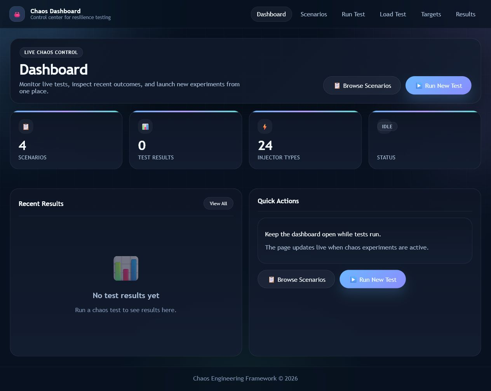
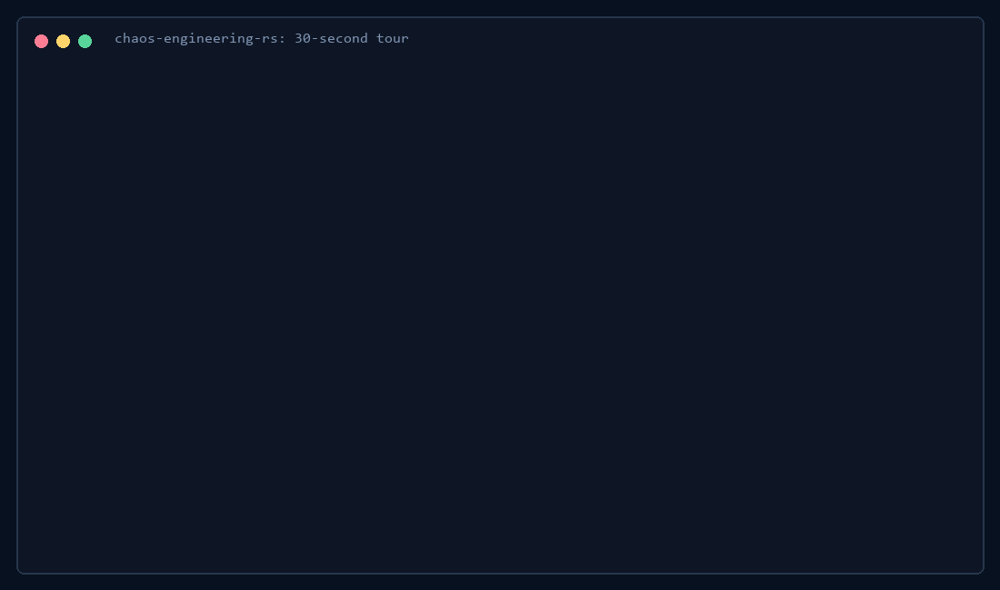

# chaos-engineering-rs

[](https://github.com/Ninian-Lemain/chaos-engineering-rs/actions/workflows/ci.yml)
[](https://github.com/Ninian-Lemain/chaos-engineering-rs/releases)
[](LICENSE-MIT)
[](#capability-matrix)

Cross-platform chaos testing for processes, containers, dependencies, databases, HTTP services, AI APIs, and CI SLO gates. It includes rootless proxy faults, a recovery journal, live Prometheus/OpenTelemetry telemetry, downloadable protocol packs, and a local dashboard.



## Why This Project

- **Honest effects:** an injector cannot report success unless it produced a measurable disruption.
- **Recovery first:** every recoverable effect is journaled before execution and can be cleaned up after interruption.
- **Rootless by default:** dependency, DNS, TLS, HTTP, AI, database, queue, media, and storage faults can run through local proxies without administrator privileges.
- **CI ready:** SLO assertions return a failing exit code, reports compare baseline and chaos runs, and the repository includes a reusable GitHub Action.
- **Protocol packs:** specialized failure scenarios stay downloadable instead of turning the core into a collection of protocol clients.



## Quick Start

Install the current release from [GitHub Releases](https://github.com/Ninian-Lemain/chaos-engineering-rs/releases), or build from source:

```bash
git clone https://github.com/Ninian-Lemain/chaos-engineering-rs
cd chaos-engineering-rs
cargo build --locked --release -p chaos_cli
./target/release/chaos doctor
./target/release/chaos list
```

Homebrew is available now:

```bash
brew install Ninian-Lemain/chaos-engineering/chaos-engineering-rs
```

The [WinGet submission](https://github.com/microsoft/winget-pkgs/pull/411247) is awaiting Microsoft review. After merge, install it with `winget install NinianLemain.ChaosEngineeringRs`.

On Windows, run `target\release\chaos.exe`. Before an experiment:

```bash
chaos validate scenarios/slo_gate.yaml
chaos dry-run scenarios/slo_gate.yaml
chaos run scenarios/slo_gate.yaml --output-json result.json
```

Open the local control surface:

```bash
chaos serve --host 127.0.0.1 --port 8080
```

See [QUICKSTART.md](QUICKSTART.md) for proxy, Docker, database, telemetry, report, and recovery examples.

## Rootless Faults

`chaos proxy` provides directional latency, jitter, bandwidth limits, connection timeouts, slow closes, byte limits, partitions, corruption, duplication, reordering, and connection-pool pressure. `chaos dns-proxy`, `chaos tls-endpoint`, and `chaos ai-proxy` add DNS answers, TLS handshake failures, HTTP delay/status/body/header faults, delayed tokens, broken SSE streams, malformed tool calls, 429 storms, and context truncation.

```bash
chaos proxy --listen 127.0.0.1:15432 --upstream 127.0.0.1:5432 \
  --direction downstream --latency 250ms --bandwidth 65536

chaos ai-proxy --provider open-ai --listen 127.0.0.1:18080 \
  --upstream https://api.openai.com --stream-delay 400ms
```

Point the application at the local listener; no kernel network rules are required.

## Scenario Packs

The catalog covers AI APIs, authentication, containers, databases, IoT/MQTT, media/HLS/WebRTC, object storage, queues, network/DNS, and Windows. Search and install only what a test needs:

```bash
chaos pack list --category ai
chaos pack show ai-openai-compatible
chaos pack install ai-openai-compatible --output ./scenarios
```

Pack status is tracked independently in [`scenario-packs/catalog.json`](scenario-packs/catalog.json). See [`scenario-packs/README.md`](scenario-packs/README.md) to author a pack.

## SLO Gates And Reports

Scenarios can continuously probe an endpoint and enforce error-rate, p95-latency, status, and minimum-sample requirements. A failed assertion exits nonzero for CI.

```yaml
assertions:
  - name: api_availability
    url: http://127.0.0.1:8080/health
    expected_status: 200
    interval: 500ms
    timeout: 1s
    max_error_rate: 0.05
    max_p95_latency: 250ms
    min_requests: 10
```

```bash
chaos run scenario.yaml --output-json chaos.json --prometheus-port 9898 \
  --otlp-endpoint http://127.0.0.1:4318/v1/metrics
chaos report chaos.json --compare baseline.json --format markdown --output comparison.md
```

Use the repository action from another workflow:

```yaml
- uses: Ninian-Lemain/chaos-engineering-rs@v0.2.0
  with:
    scenario: scenarios/api-slo.yaml
    output: chaos-result.json
```

## Safety And Recovery

Chaos tests are destructive by design. Start with disposable targets and narrow permissions.

```bash
chaos doctor                    # dependencies, permissions, journal state
chaos dry-run scenario.yaml     # validation without faults
chaos recover                   # restore interrupted effects
chaos stop-all                  # emergency cleanup of all journaled effects
```

The default journal is `~/.chaos-engineering/recovery.json`. `doctor` reports missing commands, daemon access, elevation, and blocked injectors before a run.

## Capability Matrix

Status is part of the runtime registry and is limited to **stable**, **experimental**, or **planned**. `chaos list` is the source of truth for the current operating system; `chaos doctor` adds permission and dependency checks.

| Injector | Status | Real effect / requirement |
|---|---|---|
| `aws_fault` | planned | No successful injection is exposed yet |
| `azure_fault` | planned | No successful injection is exposed yet |
| `clock_skew` | planned | Reserved for a recoverable clock implementation |
| `cloudflare_fault` | planned | No successful injection is exposed yet |
| `container_fault` | stable | Docker/Compose pause, stop, kill, restart; Docker daemon required |
| `cpu_starvation` | stable | Measured worker load; zero intensity is rejected |
| `crypto_fault` | stable/planned | TLS endpoint faults are stable; unsupported modes stay planned |
| `database_fault` | stable/experimental | DuckDB/SQLite unavailable/read-only stable; pressure modes experimental |
| `dependency_proxy` | stable | Rootless directional TCP faults and connection limits |
| `disk_fill` | stable | Real allocated bytes with journaled cleanup |
| `disk_slow` | planned | No simulated success |
| `dns_fault` | stable | Rootless DNS delay, failure, spoof, and stale-answer modes |
| `fd_exhaustion` | stable | Real handles opened and closed during recovery |
| `http_fault` | stable | HTTP/AI delay, status, truncation, malformed headers, stream faults |
| `media_streaming_fault` | planned | Available through scenario packs and proxy primitives |
| `memory_pressure` | stable | Real retained allocation; zero-effect runs are rejected |
| `network_latency` | experimental/planned | Linux/Windows experimental with elevation; macOS planned |
| `nginx_fault` | planned | No simulated success |
| `packet_loss` | experimental/planned | Linux `tc` experimental; other platforms planned |
| `process_freeze` | stable/planned | Unix signals stable; Windows planned |
| `process_kill` | experimental | Real process termination with rights validation |
| `socket_corrupt` | planned | Available through the rootless proxy, not this raw injector |
| `tcp_reset` | experimental/planned | Linux `iptables` experimental; other platforms planned |
| `windows_fault` | experimental/planned | Windows services/files/handles/pipes experimental; elsewhere planned |

Integration tests verify that stable effects disrupt their target and restore recoverable state. Planned injectors fail closed instead of pretending to run.

## Distribution

| Channel | State |
|---|---|
| GitHub binaries | Release workflow builds Windows x64, Linux x64, macOS x64/arm64 with SHA-256 files and GitHub attestations |
| GitHub Action | `action.yml` runs a scenario as an SLO gate on Windows, Linux, and macOS |
| Container | GHCR workflow builds amd64/arm64 images |
| Homebrew | Live at [`Ninian-Lemain/homebrew-chaos-engineering`](https://github.com/Ninian-Lemain/homebrew-chaos-engineering) |
| WinGet | [Validated manifest submitted](https://github.com/microsoft/winget-pkgs/pull/411247); awaiting Microsoft review |
| crates.io | Publish workflow is ready; the first release requires a personal `CARGO_REGISTRY_TOKEN` |

Verify a downloaded release artifact with GitHub CLI:

```bash
gh attestation verify chaos-v0.2.0-x86_64-unknown-linux-gnu.tar.gz \
  --repo Ninian-Lemain/chaos-engineering-rs
```

## Project

- [Roadmap](docs/ROADMAP.md)
- [Contributing](CONTRIBUTING.md)
- [Security policy](SECURITY.md)
- [Changelog](CHANGES.md)
- [Discussions](https://github.com/Ninian-Lemain/chaos-engineering-rs/discussions)
- [Issues](https://github.com/Ninian-Lemain/chaos-engineering-rs/issues)

Licensed under the [MIT License](LICENSE-MIT).
